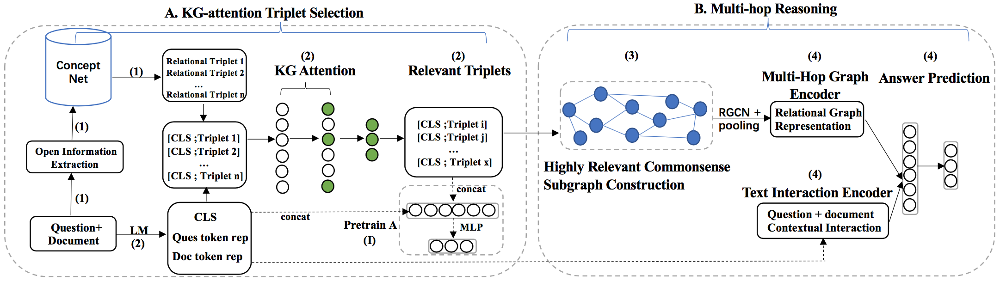

# The source code of MRRG

Paper name: Relevant CommonSense Subgraphs for "What if..." Procedural Reasoning (ACL 2022 findings)


<p align="center"></p>

## Running the evaluation code

1. Download the ckpt files (the link is shown in the ckpt folder);

2. Use the same conda experimental environment:

```
conda env create -f mrrg.yaml
```

3. Activate the conda environment:

```
source activate mrrg
```

4. Three config files:

>- run_MRRG.py
>- graph_preprocess.py
>- graph_utils/parser_utils.py

5. Run the evaluation code:

```
CUDA_VISIBLE_DEVICES=1 python run_MRRG.py --model_type roberta_cons --model_name_or_path (your_model_save_dir) --task_name wiqa --do_test --data_dir (your_data_save_dir) --max_seq_length 256 --per_gpu_eval_batch_size=8 --weight_decay 0.01 --output_dir (your_model_restore_dir) --seed 789
```


## Train the code by yourself

1. Graph Construction:

It will take a super long time (at least 10 hours.)

```
sh data_process.sh
```

>- openie: 5-6 hours
>- graph building: 3-4 hours

2. Run the training code in RoBERTa-base setting:

```
CUDA_VISIBLE_DEVICES=1 python -u run_MRRG.py --model_type roberta_cons --model_name_or_path roberta-base --task_name wiqa --do_train --data_dir (your_data_save_dir) --max_seq_length 256 --per_gpu_eval_batch_size=16 --output_dir (your_model_save_dir) --per_gpu_train_batch_size=8 --gradient_accumulation_steps=16 --learning_rate 2e-5 --num_train_epochs 10.0 --weight_decay 0.01 --lambda_a 0.5 --lambda_b 0.1 --seed 789 --unfreeze_epoch 3 --format fairseq --fix_trans -ih 0 -enc roberta-base -ds wiqa -mbs 8 -sl 80 -me 2
```

3. Experiment setup:
>- We use 1 NVIDIA TITAN RTX to train our MRRG architecture. 
>- The batch size is 8 during training process.
>- The architecture uses 11139MiB GPU memory.
>- The training process spends 5:32:50.
>- The test accuracy in WIQA test V2 is in the range of [79.8\%, 80.5\%]


### Example:

```
Training:
CUDA_VISIBLE_DEVICES=1 nohup python -u run_MRRG.py --model_type roberta_cons --model_name_or_path roberta-base --task_name wiqa --do_train --data_dir ./wiqa_augment/ --max_seq_length 256 --per_gpu_eval_batch_size=16 --output_dir ./output_add_relation_10_true_graph_20220307 --per_gpu_train_batch_size=8 --gradient_accumulation_steps=16 --learning_rate 2e-5 --num_train_epochs 10.0 --weight_decay 0.01 --lambda_a 0.5 --lambda_b 0.1 --seed 789 --unfreeze_epoch 3 --format fairseq --fix_trans -ih 0 -enc roberta-base -ds wiqa -mbs 8 -sl 80 -me 2 > chen_logs/reimplement.out &

GPU memory：11139MiB

Test:
CUDA_VISIBLE_DEVICES=1 python run_MRRG.py --model_type roberta_cons --model_name_or_path ./output_add_relation_10_true_graph_20220307 --task_name wiqa --do_test --data_dir ./wiqa_augment/ --max_seq_length 256 --per_gpu_eval_batch_size=8 --weight_decay 0.01 --output_dir ./output_add_relation_10_true_graph_20220307 --seed 789

test: {'wiqa_': 0.7995337995337995}
```


### package

>- python: 3.7
>- pytorch: 1.7.1
>- allennlp: 2.1.0 
>- allennlp-models: 2.1.0

### download

>- cpnet
>- transe
>- OpenIE: https://storage.googleapis.com/allennlp-public-models/openie-model.2020.03.26.tar.gz
